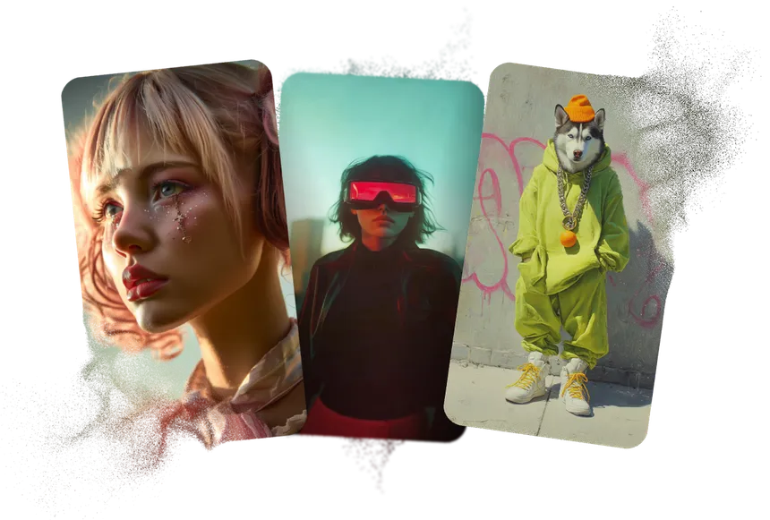
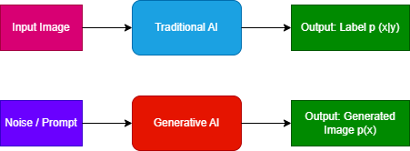
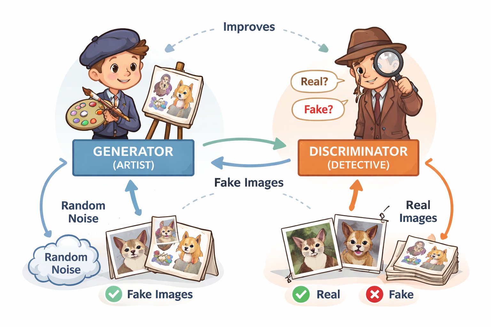
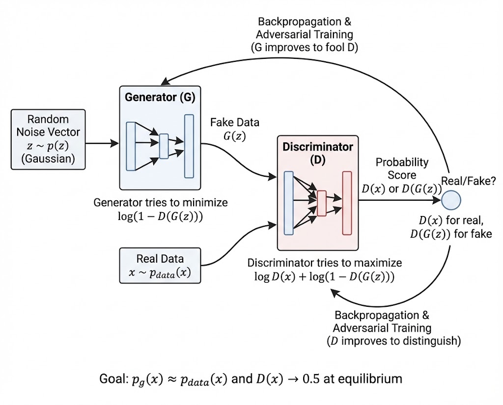
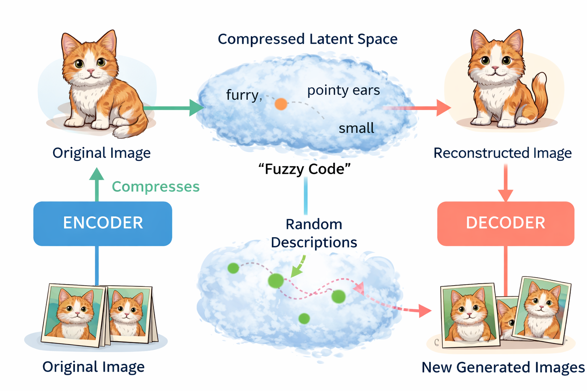
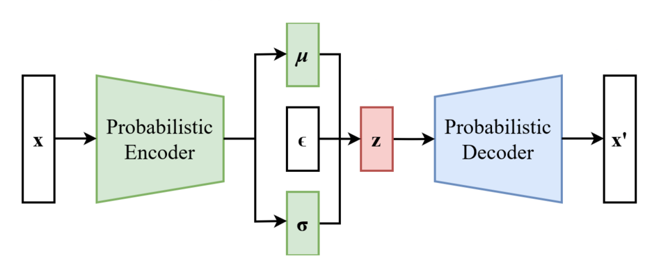
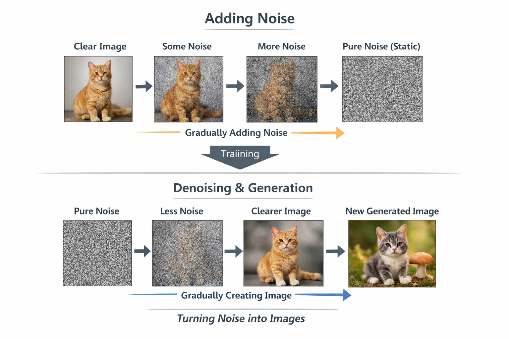
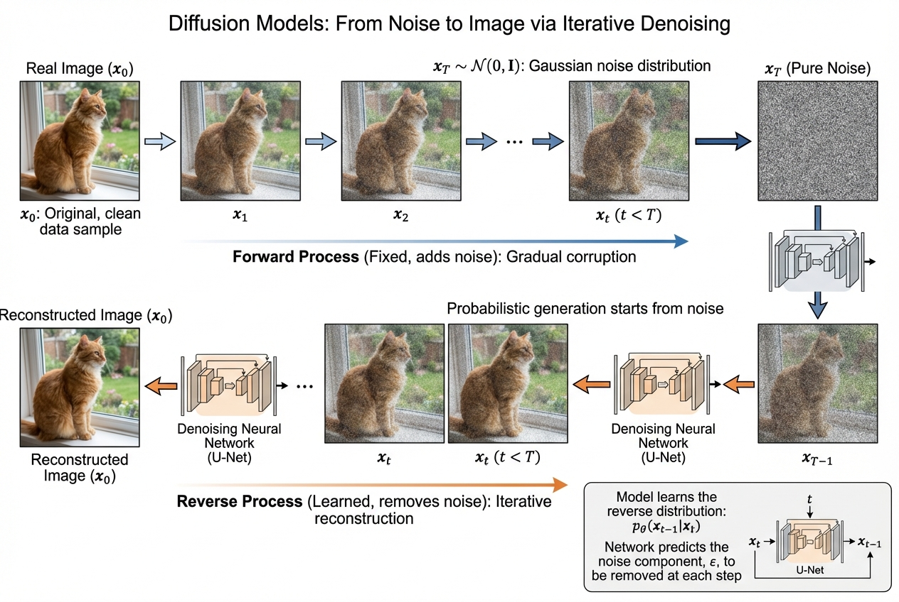

<h1 align="center">Generative AI in Computer Vision For Dummies</h1>

  

---
## Introduction

In recent years, Generative AI has emerged as a transformative force in Computer Vision, shifting the focus of models from simply understanding images to actively creating them. Unlike traditional approaches that mainly perform recognition tasks such as classification, detection, or segmentation, generative methods aim to learn the underlying data distribution of images and generate entirely new visual content.

This blog explores how generative models reshape the field of computer vision by introducing three foundational architectures: Generative Adversarial Networks (GANs), Variational Autoencoders (VAEs), and Diffusion Models. Each of these approaches offers a different way to model and generate visual data, enabling applications ranging from image synthesis and editing to data augmentation and simulation.

---
## 1. What is Generative AI?
Generative AI refers to a type of Artificial Intelligence that can create new content, such as text, images, video, or audio. By learning patterns from training data, these models generate unique outputs with similar statistical properties. Techniques like Generative Adversarial Networks (GANs), Variational Autoencoders (VAEs) and Diffusion Models are commonly used to achieve these results. 

---

## 2. Why do we need Generative AI in Computer Vision?
At a higher level, Generative AI allows computer vision systems to understand, simulate, and create visual data, not just recognize it.
Classic CV (and even standard deep learning) focuses on discriminative tasks such as classification (what is in the image?), detection (where is it?) and segmentation (which pixels belong to what?). These models learn the conditional distribution **p(y∣x)** mapping inputs to labels, but they do not capture how images themselves are formed.
Meanwhile, Gen Ai models learn the distribution of image data **p(x)**. This allows them to model the structure, variability, and semantics of visual data, unlocking capabilities beyond recognition.
One of the major challenges in computer vision is the reliance on large, labeled datasets. Collecting and annotating such data is often expensive, time-consuming, and can be biased. Generative AI helps address this limitation by enabling the creation of realistic synthetic data, reducing the dependency on manual annotation and improving scalability.
Moreover, generative models have a wide range of applications, including image synthesis, editing, restoration, and simulation. They are increasingly used in fields such as design, marketing, gaming, and film, where the ability to generate high-quality visual content is essential.

  

---

## 3. Main Generative Architectures (ELI5)

### 3.1 Generative Adversarial Networks (GANs)
GANs can be understood as a simple game between two neural networks: a generator and a discriminator. The generator acts like an artist, creating images from random noise, while the discriminator plays the role of a detective, trying to distinguish between real images and those produced by the generator. During training, the generator continuously improves its ability to produce realistic images in order to fool the discriminator, while the discriminator simultaneously becomes better at identifying fakes. This adversarial process pushes both networks to improve over time, until the generated images become increasingly indistinguishable from real ones. In the end, the trained generator is capable of producing high-quality, realistic images, making GANs a powerful tool in generative AI.

  

From a technical standpoint, GANs can be formulated as a minimax optimization problem where two neural networks are trained simultaneously in competition. The generator \( G(z) \) maps a random latent vector \( z \sim p(z) \) (typically Gaussian or uniform noise) into the data space, producing synthetic samples \( G(z) \). The discriminator \( D(x) \) is trained to estimate the probability that a given input \( x \) originates from the real data distribution \( p_{data}(x) \) rather than the generator distribution \( p_g(x) \).

The training objective is defined as:

$$
\min_{G} \max_{D} V(D, G) = \mathbb{E}_{x \sim p_{data}(x)} [\log D(x)] + \mathbb{E}_{z \sim p_{z}(z)} [\log(1 - D(G(z)))]
$$

This adversarial loss encourages the generator to approximate the true data distribution implicitly by minimizing the divergence between \( p_g(x) \) and \( p_{data}(x) \), while the discriminator improves its ability to distinguish real from synthetic samples. Ideally, at equilibrium, the generator recovers the underlying data distribution such that \( p_g(x) \approx p_{data}(x) \), leading the discriminator to output \( D(x) = 0.5 \) for all inputs, indicating maximal uncertainty. However, in practice, GAN training is often unstable due to issues such as non-convergence, vanishing gradients, and mode collapse, where the generator produces limited diversity despite high realism.

  

**Concrete Example**
Imagine a fashion company that wants to create new clothing designs without organizing expensive photoshoots.

A GAN can be trained on thousands of images of clothes.  

- The generator creates new clothing designs  
- The discriminator checks if they look realistic  

Over time, the model can generate completely new outfits that look like real photos.

### 3.2 Variational Autoencoders (VAEs)
VAEs can be understood as a system that learns to compress and recreate images in a meaningful way. Imagine a machine that takes a picture of a cat and squeezes it into a small, fuzzy description, something like “small, furry, pointy ears,” but with a bit of uncertainty. This compressed representation doesn’t store exact details but instead captures the general essence of the image. A second part of the system then uses this description to reconstruct the image, producing something that looks like the original cat, even if not perfectly identical. Because the representation is smooth and continuous, similar descriptions lead to similar images. This means we can also generate entirely new images by sampling random descriptions and feeding them into the system, allowing VAEs to create new, realistic variations rather than simply memorizing existing data.

  

Variational Autoencoders are generative models that learn to compress images into a structured **latent** space and reconstruct them back. A VAE consists of two main components: an encoder, which maps an input image to a distribution in a lower-dimensional latent space, and a decoder, which reconstructs the image from this latent representation. Unlike traditional autoencoders that map inputs to fixed codes, VAEs model uncertainty by encoding inputs as probability distributions, ensuring that similar inputs are mapped to nearby regions in the latent space. This results in a smooth and continuous representation of the data, allowing new images to be generated by sampling random points from the latent space and passing them through the decoder. As a result, VAEs provide a principled way to both learn meaningful representations and generate realistic data.

  

**Concrete Example**
Suppose we have a dataset of handwritten digits (like 0-9).

A VAE learns to:
- Compress each digit into a simple latent representation  
- Reconstruct it back into an image  

Because the latent space is smooth, we can:
- Slightly modify a "3" to get different styles of "3"
- Move between "1" and "7" to see gradual transformations
### 3.3  Diffusion Models

Diffusion models can be intuitively understood as a process of gradually destroying and then reconstructing an image. Imagine starting with a clear picture, such as a cat, and slowly adding noise to it step by step until it becomes completely random static, where no structure is recognizable. During training, the model learns how to reverse this process: given a noisy image, it predicts how to make it slightly less noisy, repeating this refinement over many steps. Once trained, the model can generate entirely new images by starting from pure random noise and progressively transforming it into a coherent image, where rough shapes emerge first and are then refined into detailed visual content. In essence, diffusion models learn how to turn noise into meaningful structure, enabling the generation of high-quality and realistic images.

  

From a technical perspective, diffusion models are probabilistic generative models that learn data distributions by reversing a Markovian noising process. During the forward process, an input image x0 ~ p_data(x) is gradually corrupted by adding Gaussian noise over a fixed number of time steps t = 1, ..., T, eventually transforming it into a nearly isotropic Gaussian distribution xT ~ N(0, I).

The reverse process is learned by a neural network (typically a U-Net) that parameterizes the conditional distribution p_theta(x_{t-1} | x_t), effectively learning to denoise step by step. The training objective is formulated as a variational bound, commonly simplified into predicting the added noise at each timestep.

Once trained, sampling begins from pure noise xT and iteratively applies the learned denoising steps to reconstruct a coherent sample from the learned data distribution. This iterative refinement process allows diffusion models to achieve highly stable training and state-of-the-art sample quality, at the cost of increased computational complexity during generation.

  

**Concrete Example**
Imagine you type:
> "A small cat wearing sunglasses on the beach"

A diffusion model starts from **pure noise** and gradually transforms it into an image that matches the description:
- First: random shapes  
- Then: rough outline of a cat  
- Finally: detailed image with sunglasses and background  
Diffusion models can be used in AI image generators (art, design, marketing) or creating illustrations from text descriptions.

---

## 4. Comparison of Architectures
Generative Adversarial Networks (GANs), Variational Autoencoders (VAEs), and Diffusion Models all aim to generate new data, but they rely on different core ideas and come with distinct trade-offs. GANs are based on an adversarial game between a generator and a discriminator, which drives the model to produce highly realistic images; however, they can be difficult to train and may suffer from instability or mode collapse (limited diversity). VAEs, on the other hand, learn a structured latent space by encoding data into probabilistic representations and decoding them back, making them stable and interpretable, but often producing blurrier and less detailed images. Diffusion models take a different approach by learning to gradually denoise data, transforming random noise into coherent images step by step; they are known for generating high-quality and diverse outputs, but at the cost of slower generation due to the iterative process. Together, these architectures illustrate different ways of modeling data distributions, each balancing realism, stability, and computational efficiency.
| Model      | Core Idea                              | How it Works                                      | Advantages                              | Limitations                              |
|------------|----------------------------------------|--------------------------------------------------|------------------------------------------|-------------------------------------------|
| GAN        | Adversarial game (Generator vs Discriminator) | Generates data by fooling a discriminator        | Very realistic and sharp images          | Hard to train, unstable, mode collapse    |
| VAE        | Probabilistic encoding in latent space | Encodes input -> samples latent space -> decodes   | Stable training, interpretable latent space | Blurry outputs, less sharp details        |
| Diffusion  | Gradual denoising process              | Learns to remove noise step-by-step from data    | High-quality, diverse, and realistic outputs | Slow generation, computationally expensive |

---
## Conclusion

Generative AI has fundamentally expanded what is possible in computer vision. By moving beyond recognition and into data generation, models such as GANs, VAEs, and diffusion models provide powerful tools for understanding and recreating complex visual structures. Each architecture brings its own strengths and trade-offs: GANs excel in realism, VAEs offer structured and interpretable representations, and diffusion models deliver unmatched image quality and diversity.

Together, these methods illustrate the evolution of generative modeling from adversarial learning to probabilistic representation and iterative refinement. As research continues to advance, we can expect even more efficient, controllable, and high-fidelity generative systems that will further blur the line between real and synthetic visual content, unlocking new possibilities across science, design, entertainment, and beyond.

### The Author
Youssef Aitbouddroub
[Github profile](https://github.com/BigB021)
[LinkedIn](https://www.linkedin.com/in/youssef-aitbouddroub-674945316/)
